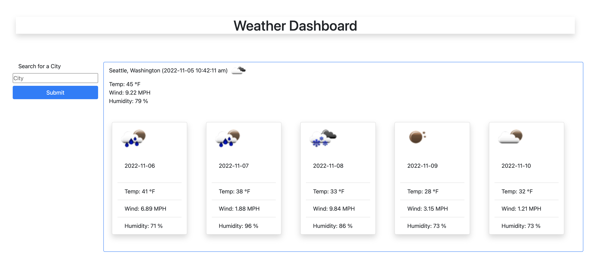

# Weather dashboard web app. Homework #6

Weather dashboard is a web application which was created as part of Homework #6.  
The application was created to check 5-days weather forecast for a selected city.  
The server API of the OpenWeather company was used.

## Usage

The project was deployed using Github hosting and is available  
at the link https://kas500.github.io/weather-dashboard/

By default, the main page of the application displays the current weather  
and a five-day forecast for the city of Seattle.   
To display another city, you must enter the name of the city in the search field and click the submit button.   
It is also possible to select a city from the search history.

## Picture #1
